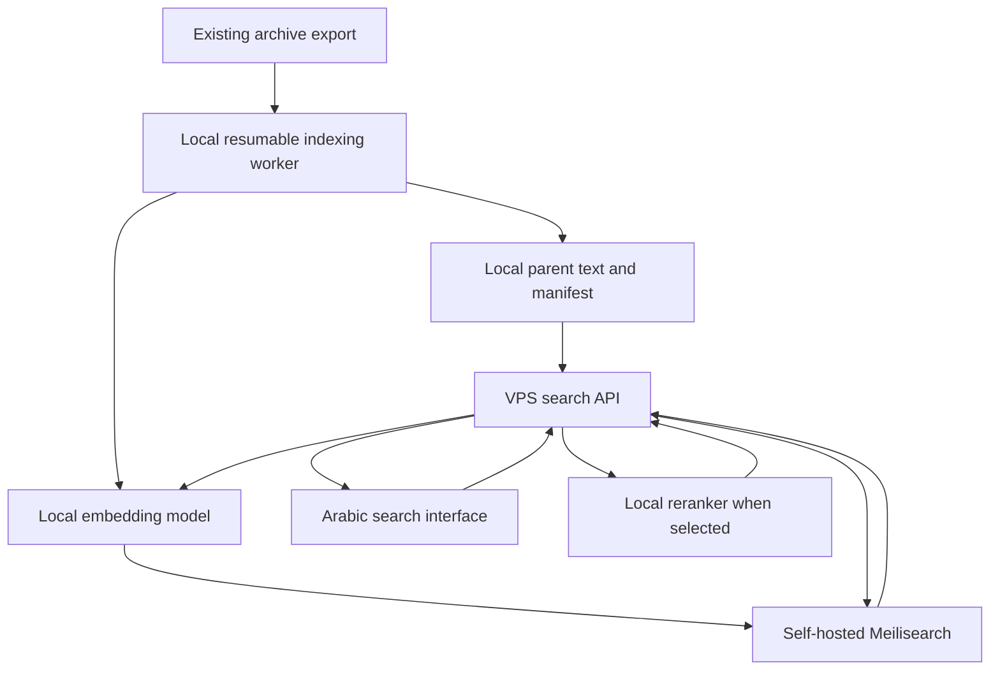

# Arabic Search Implementation and Evaluation Plan

**Project:** Kashaf Alkulify

**Prepared:** September 12, 2026

**Status:** Implementation proposal. No corpus benchmark or VPS performance measurement has been run for this plan.

The objective is to help Arabic-speaking visitors find the sheikh's actual words, open the relevant source, and read or listen to enough context to understand them. A successful search finds useful evidence within the first few results without misrepresenting a quotation, an objection, or an incomplete explanation as the sheikh's position.

Start with self-hosted Meilisearch and locally generated BGE-M3 embeddings. Evaluate BGE-reranker-v2-m3 as a separate improvement, alongside a smaller multilingual reranker. Choose the final configuration from corpus-specific experiments. Accuracy takes priority over response time; resource limits and reliable operation still matter.

## 1. Requirements and decision boundaries

| Area | Agreed requirement |
| --- | --- |
| Audience | General readers and students of Islamic knowledge |
| Language | Arabic content and Arabic queries, including informal query wording |
| Audio | Approximately 4,000 transcribed hours; existing segments are roughly 30 seconds and influenced by pauses |
| Articles | Approximately 4,000 articles |
| User tasks | Find a remembered phrase, find discussion of a ruling, or investigate whether the sheikh discussed a topic and expressed a view |
| Search scope | Visitors select audio lessons or articles before submitting a search |
| Output | Original excerpts, sources, and navigation to the relevant location |
| Generated answers | Out of scope: no synthesized answers, chatbot, generated fatwas, or generated summaries |
| Infrastructure | Existing VPS without GPU; no new external search, embedding, reranking, or AI services |
| Priority | Result relevance, coverage, and faithful presentation before speed |
| Method | Compare alternatives using the same evaluation protocol and explicit checklists |

The repository already uses Convex and R2 for its archive. This plan interprets the local-only requirement as applying to the new search system and all model inference. It introduces no new managed service. Existing archive storage is an input to a local export, not an inference provider. Migrating the entire existing archive away from Convex/R2 would be a separate project; search queries and model inputs must not be sent to an external AI service.

The plan does not assume the VPS can run every candidate configuration. Phase 0 records its CPU, RAM, disk, and existing workloads. If a configuration cannot run reliably, record that result and test the next local option.

### Decisions made now

- Keep the original source text and its provenance.
- Separate audio and article search in the interface and indexes.
- Offer ordinary search and an explicit phrase-matching option.
- Preserve negation, conditions, exceptions, and attribution.
- Keep inference and evaluation local.
- Evaluate retrieval before judging reranking.
- Publish no claim that a topic was never discussed merely because search found nothing.

### Decisions to make from experiments

- Audio and article passage boundaries and context length.
- Which Arabic character folds improve retrieval without unacceptable collisions.
- BGE-M3 versus an alternative embedding model.
- Whether reranking helps, which reranker to use, and how many candidates to score.
- Native Meilisearch hybrid ranking versus explicit lexical/dense result fusion.
- Score thresholds, model precision, CPU batch sizes, and operating capacity.
- Whether any measured limitation justifies replacing Meilisearch.

## 2. User experience and expected behavior

### 2.1 Search journeys

The examples below describe search intent. They do not assert that the archive contains the corresponding material.

| User need | Example query | Successful result | Failure to avoid |
| --- | --- | --- | --- |
| Remembered phrase | `العبرة بالخواتيم` | The passage containing the phrase, with its source and location | A related discussion that never contains the requested phrase, presented as a phrase match |
| Imperfect recollection | `قال الشيخ إن كثرة القراءة لا تكفي` | Relevant wording even if the visitor remembers it approximately | Requiring the visitor to reproduce an inaccurate transcript exactly |
| Ruling or position | `حكم تخصيص يوم معين بعبادة` | A passage that contains the actual discussion, including qualifications | A question, quoted opinion, or refuted statement shown without its continuation |
| Topic investigation | `هل تكلم الشيخ عن الرياء في طلب العلم؟` | Places where this subject is discussed, with surrounding context | Matching only a repeated lesson title or a passing mention |
| Informal wording | `كيف أعرف إني أطلب العلم عشان الناس؟` | Relevant Arabic discussion despite different vocabulary | Treating lack of shared keywords as proof that no relevant discussion exists |

### 2.2 Interface

Use a single search form with two clearly labeled scope choices: **الدروس الصوتية** and **المقالات**. Require an initial choice, then remember it locally. Changing scope preserves the query and resets pagination. Make the selection visible; do not search both collections secretly and combine their scores.

Within the selected scope:

- Default label: **بحث**. Explain that visitors can enter a topic, question, or remembered words.
- Optional control: **مطابقة العبارة**. Explain its defined tolerance for diacritics and punctuation.
- Submit with a button or Enter. Avoid running model inference on every keystroke.
- Provide cancellation and a visible loading state. Keep the submitted text and selected scope visible while waiting.
- Add filters only for reliable metadata: a specific lesson, series, or article category when available. Do not invent categories automatically.
- Support RTL layout, keyboard navigation, accessible control names, and announced result/loading states.

A phrase-matching submission requires the phrase. Ordinary search can accept approximate recollections. If the whole query is enclosed in quotation marks, treat it as phrase intent; show the active mode so the behavior is understandable. Define supported quotation characters and unmatched-quote handling in one small input contract. Do not implement a general query language.

### 2.3 Result cards

| Audio result | Article result |
| --- | --- |
| Lesson title and series, if known | Article title and source |
| Verbatim transcript excerpt | Verbatim article excerpt |
| Timestamp or timestamp range | Paragraph/section location |
| **استمع من هنا** | **افتح موضع النص** |
| **اعرض السياق** and full lesson link | **اعرض السياق** and full article link |
| Transcript review status, when known | Publication date, when reliable |

The snippet should contain the matched evidence. If retrieval matched only a neighboring passage, anchor the result to that passage or display the context range that actually supports the match. Do not highlight unrelated center text simply because its surrounding window matched.

For semantic results without shared words, show a useful original excerpt rather than fabricated highlighting. Prefer punctuation or sentence boundaries around the match. Keep the original Arabic visible even when the searchable representation is normalized.

Group nearby audio hits into one continuous occurrence where their evidence spans overlap. Preserve separate occurrences elsewhere in the same lesson. Group article hits under the article, with an option to expand additional relevant paragraphs. A repeated title or overlapping chunk must not occupy most of the first page.

### 2.4 Empty and incomplete results

- Ordinary empty state: **لم نعثر على نتائج مناسبة في المحتوى المفهرس.**
- Phrase empty state: **لم نعثر على هذه العبارة في المحتوى المفهرس.** Offer ordinary search while preserving the phrase.
- Show corpus coverage if some lessons or articles are not yet searchable.
- Distinguish no match from timeout, unavailable inference, incomplete candidate processing, and unavailable audio.
- Never label a result with a model-derived percentage as though it were a verified probability of relevance or proof of the sheikh's position.
- Use locally reviewed examples as suggestions. Do not generate suggested religious conclusions.

## 3. Fit with the current repository

These observations come from reading local files, not querying production data.

| Existing area | Relevant observation | Planned treatment |
| --- | --- | --- |
| [Schema](/Users/haithamassoli/Desktop/bional/kashaf-alkulify/convex/schema.ts) | Lessons, ordered parts, part offsets, transcript references, articles, review state, and deletion markers already exist | Reuse source identities and provenance; add a derived search export |
| [Normalization helper](/Users/haithamassoli/Desktop/bional/kashaf-alkulify/convex/lib/normalize.ts) | `norm-v1` folds alef variants, `ة/ه`, and `ى/ي`, and removes Unicode marks for title search | Preserve this existing contract; do not silently reuse it as the strict transcript normalization policy |
| [Transcript mutation](/Users/haithamassoli/Desktop/bional/kashaf-alkulify/convex/mutations.ts) | Transcript pointers change after artifacts are written; composition identity is tracked separately | Include the actual transcript revision/content hash in search invalidation |
| [Audio access](/Users/haithamassoli/Desktop/bional/kashaf-alkulify/convex/media.ts) | Current playback signing is tied to admin-authorized access to a private bucket | Add a public-content playback path before public search launch; do not expose the admin action |
| [Astro configuration](/Users/haithamassoli/Desktop/bional/kashaf-alkulify/astro.config.mjs) | No server adapter is configured in the inspected file | Do not assume a deployed Astro server endpoint already exists; provide a VPS search API behind the site's routing |

Do not infer that `reviewStatus: approved` certifies transcript accuracy. The existing review workflow may concern lesson grouping rather than transcription. Establish publication eligibility and transcript review status separately during the data audit.

During implementation, read the project's current Convex guidance before changing backend code, and consult the relevant Astro routing, component, and styling guides before frontend work. Keep this document's proposal separate from any deployment authorization.

## 4. Corpus audit and capacity estimate

At an average of 30 seconds per segment:

`4,000 hours × 3,600 seconds ÷ 30 = approximately 480,000 source segments`.

This is a planning estimate, not a measured document count. Existing silence handling, duplicate audio, excluded material, passage merging, and overlap change the final count. Article count is not article-passage count.

Collect a local inventory with:

- Unique lessons, unique media objects, playable hours, and transcript coverage.
- Segment duration, character count, and token count distributions: median, p90, p99, and maximum.
- Counts of empty, repeated, corrupted, very short, and unusually long transcript segments.
- Availability of word-level or segment-level timestamps and their measured accuracy.
- Article lengths, paragraph structure, headings, duplicate/reposted articles, and source links.
- Original versus normalized field availability.
- Transcript engine/version and human correction status, when known.
- Publication eligibility, deletion state, and missing metadata.

Inspect a stratified sample against the audio: short and long lessons, different recording quality, names, Quranic quotations, hadith quotations, fast speech, and segment boundaries. Track retrieval-relevant transcription errors separately from general spelling errors. A missing `لا` matters even when the rest of the sentence is correct.

Use exact hashes to identify exact duplicates. Investigate near duplicates before hiding anything. Keep alternate sources and repeated occurrences available through provenance.

For BGE-M3's 1,024-dimensional vectors, 480,000 float32 vectors contain about **1.97 GB decimal / 1.83 GiB** of raw vector values. This excludes the lexical/vector index structures, text, model weights, runtime memory, article passages, caches, and rebuild copies. Measure actual index and process sizes rather than selecting a VPS from this number alone.

## 5. Passage construction and context

Keep two concepts explicit: the **evidence span** that a visitor opens, and the **context span** the retriever or reranker reads. Store their relationship. Model input length must not determine what the interface claims the speaker said.

### 5.1 Audio alternatives

| ID | Construction | Reason to test | Main risk |
| --- | --- | --- | --- |
| A0 | Existing segments, unchanged | Cheap reference using current timing | Questions, conditions, or replies can cross boundaries |
| A1 | Center segment plus bounded preceding/following context | Preserves a precise playback anchor while providing nearby explanation | Context can dominate and make adjacent windows look identical |
| A2 | Merge neighboring segments at sentence/pause boundaries into coherent passages | Can keep an explanation together | Automatic punctuation and pauses do not always mark topic boundaries |

Use A0 as the reference. For A1, initially test one neighbor on each side, with a token budget. For A2, begin around 45–120 seconds as an experimental range, not a forced rule. Split long passages at the best available sentence boundary and retain a short overlap. Never concatenate across different lessons or an unresolved composition gap.

Test model-input caps such as 256 and 512 total tokens first, then longer inputs on cases where missing context matters. Count tokens with the actual model tokenizer, including query and special tokens for reranking. Audit truncation; a trailing exception must not vanish unnoticed. Expand or reconstruct context from source text instead of slicing an arbitrary character count.

Retain the original source segments under every merged passage. If word timestamps are unavailable, link to the enclosing source segment and label its timing appropriately. Do not manufacture word-accurate timestamps.

When a passage crosses a media-part boundary, playback must map the lesson-relative timestamp to the correct part-relative timestamp using the part offsets. Test seeking and continued playback across that boundary.

### 5.2 Article alternatives

- **P0:** Whole short articles; paragraph passages for long articles.
- **P1:** Adjacent paragraphs combined into passages near a 256-token target.
- **P2:** Larger passages near 512 tokens with a bounded paragraph overlap.

Preserve headings, paragraph order, citations, and nearby attribution. Include a concise title/section prefix in an experimental embedding template; compare with body-only input. Keep the display excerpt anchored to original body text. Do not let a broadly worded title make every paragraph rank for the same topic.

Evaluate audio and article chunking independently. They do not need identical passage sizes, thresholds, or reranking budgets.

### 5.3 Evidence presentation rules

- Preserve the continuation after `لكن`, `إلا`, `بشرط`, and similar qualifications when it is needed to interpret the excerpt.
- Keep an objection together with a nearby answer when possible.
- Expand source context; do not add an LLM to rewrite an incomplete snippet.
- If the position remains unclear, show the source faithfully. A reranker is not an attribution or doctrinal-verification system.
- Support phrase matching across source-segment and paragraph boundaries through overlapping passages and verification against the continuous parent text.

## 6. Arabic Text Normalization

### 6.1 Separate representations

| Representation | Purpose | Policy |
| --- | --- | --- |
| `original_text` | Display, quoting, provenance, correction history | Preserve the stored source exactly |
| `lexical_text` | Word retrieval | Versioned, measured normalization profile |
| `phrase_text` | Verify phrase matches | Conservative token sequence with explicitly defined tolerances |
| `model_text` | Embeddings and reranking | Readable Arabic with light cleanup; preserve meaning-bearing words and letter distinctions by default |

These are conceptual representations. Derive temporary values when practical; do not store four complete corpus copies without a measured need. Keep original parent text locally so verification and context reconstruction do not depend on a live external request.

Meilisearch already provides Arabic tokenization/normalization behavior through Charabia. Probe the pinned engine version before adding equivalent preprocessing. Its internal matching behavior does not define the application's stricter phrase-verification contract. [Meilisearch language support](https://www.meilisearch.com/docs/resources/help/language)

### 6.2 Profiles to compare

| Transformation | Strict phrase verification | Lexical experiments | Embedding/reranking baseline |
| --- | --- | --- | --- |
| Unicode canonical normalization | NFC before other processing | NFC; test targeted presentation-form compatibility conversion | Light canonical cleanup |
| Arabic presentation forms/ligatures | Explicit tested conversion of letter presentation forms | Same; compare broader compatibility handling only after inspecting changes | Preserve words; no automatic expansion of devotional symbols into added prose |
| Repeated whitespace | Collapse to token boundaries | Collapse | Clean excess whitespace; preserve paragraph boundaries where useful |
| Tatweel `ـ` | Ignore | Remove | Remove |
| Ordinary harakat | Ignore a reviewed allow-list | Compare retaining/removing | Start with source wording; compare harakat removal separately |
| Quranic annotation signs | Explicit reviewed treatment with source-offset preservation | Separate experiment; preserve boundaries | Keep by default until tested |
| Alef variants `أ إ آ ٱ` | Keep distinct from plain `ا` | Test folding to `ا` | Keep spelling by default |
| `ى` and `ي` | Keep distinct | Optional tolerant profile | Keep distinct |
| `ة` and `ه` | Keep distinct | Optional tolerant profile | Keep distinct |
| `ؤ`, `ئ`, and hamza | Keep distinct | No broad fold by default | Keep distinct |
| Arabic/Persian digit glyphs | Treat equivalent numeric glyphs as equivalent | Fold to a common digit representation | Preserve numeric values; test one consistent representation |
| Punctuation | Treat separators as boundaries; preserve token order | Normalize separators without joining words | Preserve useful sentence structure |
| Invisible/control characters | Review explicitly; prevent accidental word joining | Same | Same |
| Stemming/root extraction | None | Separate optional experiment only | None |
| Stop-word removal | None | Empty stop-word list initially | None |

The phrase option means the same consecutive words under the published harmless-variation policy; it is not byte-for-byte matching. Its help text must explain that ordinary diacritics, tatweel, numeric glyphs, spacing, and separating punctuation can differ. Letter substitutions such as `ة/ه` are outside this strict contract. Visitors can switch to ordinary search for approximate wording.

Do not remove every Unicode combining mark indiscriminately. Normalize canonically first and use a reviewed list for ordinary harakat; hamza/madda composition and Quranic notation need explicit cases. A broad compatibility normalization may expand symbols or change character lengths. Every accepted transformation needs an example and a verified mapping back to the original.

For punctuation, compare token sequences rather than a substring that can match inside a larger word. Removing punctuation must not join two words. Do not match across unrelated parent documents, hidden editorial sections, or a known transcript gap.

### 6.3 Meaning protection

Preserve at least `لا`, `لم`, `لن`, `ليس`, `غير`, `إلا`, `إن`, and `إذا`, as well as contextual words such as `يجوز`, `يحرم`, and `يكره`. Maintaining these tokens does not prove that the ranking model understands their relationship; the evaluation set must test that separately.

Do not equate religious terms through a generic synonym list. If real queries establish a need, add a small reviewed alias list for spelling variants, names, or source identifiers. Keep it versioned and distinguish aliases from theological equivalence. Record directionality when an expansion is not symmetric.

Do not automatically replace a transcript's Quranic or hadith wording with a canonical text. Any human correction becomes a new source revision, with the original retained. Search can tolerate some spelling variation; it cannot reconstruct an omitted word with certainty.

### 6.4 Minimum normalization fixture set

| Input pair or case | Expected behavior |
| --- | --- |
| `الصَّلَاة` / `الصلاة` | Match under the ordinary-harakat tolerance |
| `الصــلاة` / `الصلاة` | Match after tatweel removal |
| `١٢٣` / `۱۲۳` / `123` | Preserve and compare the same numeric value |
| `الإيمان` / `الايمان` | Distinct in strict mode; test recall gain from tolerant alef folding |
| `رحمة` / `رحمه` | Distinct in strict mode |
| `على` / `علي` | Distinct in strict mode; explicitly measure collisions in tolerant mode |
| `إن` / `أن` | Distinct in strict mode; document the collision risk of alef folding |
| `يجوز` / `لا يجوز` | Distinct propositions; the latter must retain negation in all representations |
| `يجوز بشرط...` | Preserve the condition through preprocessing, chunking, and display |
| Composed/decomposed hamza and madda | Canonically equivalent spellings behave consistently without broad hamza deletion |
| Quranic signs, presentation forms, and devotional symbols | Reviewed expected outputs; no invented words or broken source offsets |
| Phrase crossing a segment boundary | Found and mapped to its true source range |
| Same words in a different order or inside larger words | Rejected by strict phrase verification |
| Combining marks, emoji, and mixed RTL/LTR text before a match | Highlight the correct original span |

One shared fixture file must run against every language/runtime that normalizes text. The current TypeScript title helper and the archive's Python behavior already have a documented difference around Unicode marks. Do not propagate that difference into transcript search. Prefer one authoritative search normalizer; if both runtimes need it, enforce parity from fixtures.

Normalization versions belong in the index manifest. A rule change must trigger the appropriate lexical rebuild, embedding rebuild if model input changed, and cache invalidation. Never mix query and document normalization versions unintentionally.

## 7. Local architecture and document contract



Use one public search API and private local access to Meilisearch and inference. The browser sends the scope, mode, query, and approved filters; the API owns normalization, model selection, ranking, grouping, and verification. Users never choose model names, hybrid weights, or internal index names.

Start with the fewest processes that fit memory and operational needs. The embedding and reranking handlers can share one inference service. Avoid loading another full model copy for every web worker. Use a separate low-priority indexing job so batch work can pause during interactive use.

A local SQLite database is sufficient for the parent-text snapshot, publication manifest, checkpoints, and a durable indexing queue if the existing archive worker does not already provide them. Reuse an existing worker/queue before adding one. No Kubernetes, message broker, LangChain, vector abstraction framework, or additional database is required by this plan.

### 7.1 Search documents

Use two versioned indexes, for example `audio_passages_v1` and `article_passages_v1`. Each stores one retrievable passage per document.

| Field group | Contents |
| --- | --- |
| Identity | `id` as a deterministic ASCII-safe digest; `parent_id`; passage ordinal |
| Source revision | Source content hash, transcript revision, and audio assembly revision where applicable |
| Text | Original excerpt and selected lexical fields; model text can be derived |
| Context | Source segment IDs or paragraph range; evidence and context offsets |
| Audio coordinates | Lesson-relative start/end; original part IDs and timing references |
| Article coordinates | Stable paragraph IDs/ranges and section title when present |
| Navigation | Public source route, title, and reliable series/date metadata |
| Eligibility | Publication state and source revision used when indexed |
| Versions | Normalization, passage construction, embedding model revision, and input-template version |
| Embedding | A named vector under Meilisearch's `_vectors` field |

Keep full parent text and fine-grained source mappings in the local source snapshot when they are unnecessary in the search index. Define one offset unit, such as Unicode code points, and convert explicitly for browser UTF-16 indexing. Test this conversion rather than assuming Python and JavaScript string positions agree.

Do not return raw vectors, private storage keys, admin metadata, or credentials to visitors. Durable result URLs reference source identity and location, not expiring signed audio URLs. When a correction invalidates an old location, resolve it only after verifying the evidence against the new revision; otherwise show that the source changed and offer the parent document. Do not silently send an old quotation link to unrelated text.

### 7.2 Explicit local embedding integration

The initial recommendation is Meilisearch's `userProvided` embedder. The worker supplies document vectors; the API supplies the query vector. This makes input preprocessing, revision pinning, and CPU execution explicit. This source does not use Meilisearch's `documentTemplate`; build the model input in the local worker instead. [User-provided embeddings](https://www.meilisearch.com/docs/capabilities/hybrid_search/how_to/search_with_user_provided_embeddings)

Illustrative index settings for the BGE-M3 experiment:

```json
{
  "embedders": {
    "bge_m3": {
      "source": "userProvided",
      "dimensions": 1024
    }
  }
}
```

A hybrid request must include the lexical `q`, the locally produced `vector`, and `hybrid.embedder`. Set `hybrid.semanticRatio` from the selected experiment. A lexical-only request should not require model inference.

Before implementation, pin the Meilisearch version and verify these settings against that release. Do not copy an example vector with the wrong dimension. Reject missing, non-finite, incorrectly sized, or invalid vectors during indexing and querying.

## 8. Engine and model options

### 8.1 Search engine decision

| Engine | Role in this plan | Trigger for testing it |
| --- | --- | --- |
| Meilisearch | Primary engine for lexical and dense retrieval | Start here and establish corpus-specific results |
| Qdrant | Conditional alternative for explicit dense/sparse/multivector retrieval | A measured need for learned sparse retrieval or late interaction that the chosen Meilisearch design cannot satisfy well |
| OpenSearch | Conditional alternative for more configurable lexical analysis and query behavior | Repeated phrase/Arabic lexical failures that require analyzer or query controls unavailable in the pinned Meilisearch release |

Qdrant supports multi-stage hybrid queries; its availability is not evidence that it will improve this corpus. Moving to it also requires accounting for the user-facing lexical and phrase behavior currently supplied by Meilisearch. [Qdrant hybrid queries](https://qdrant.tech/documentation/search/hybrid-queries/)

OpenSearch exposes an Arabic analyzer and custom analyzer components. Its defaults include stop-word removal and stemming, which must be reviewed against this plan's meaning-preservation rules rather than enabled indiscriminately. [OpenSearch Arabic analyzer](https://docs.opensearch.org/latest/analyzers/language-analyzers/arabic/)

Keep Meilisearch unless a concrete failed acceptance criterion persists after fixing data preparation and tuning. Do not deploy several production search engines just to keep options open.

Meilisearch's built-in lexical ranking is not interchangeable with a BM25 implementation. Likewise, using dense BGE-M3 vectors with Meilisearch lexical search does not automatically use BGE-M3's learned sparse output or ColBERT-style interaction. Record exactly which retrieval mechanisms each experiment uses. [Meilisearch ranking rules](https://www.meilisearch.com/docs/capabilities/full_text_search/relevancy/ranking_rules), [BGE-M3 model card](https://huggingface.co/BAAI/bge-m3)

### 8.2 Embedding candidates

| Candidate | Initial role | Protocol |
| --- | --- | --- |
| `BAAI/bge-m3` | Baseline | Dense vectors, 1,024 dimensions, pinned model/tokenizer revision |
| `Qwen/Qwen3-Embedding-0.6B` | Main challenger | Full supported output dimensions initially; use the documented query instruction and pooling behavior |
| `Qwen/Qwen3-Embedding-4B` | Optional quality-oriented experiment | Attempt only if measured memory capacity allows; test on the pilot before a full-corpus rebuild |

BGE-M3 does not require adding a query instruction in its documented standard usage. Qwen3 Embedding distinguishes instructed queries from documents and supports configurable output dimensions. Use each model's own documented protocol; identical preprocessing instructions are not automatically a fair comparison. [BGE-M3 usage](https://huggingface.co/BAAI/bge-m3), [Qwen3 Embedding usage](https://huggingface.co/Qwen/Qwen3-Embedding-0.6B)

For a fair experiment, hold the source spans and evaluation cases fixed while allowing the documented input protocol for each model. Record dimensions, pooling, precision, vector normalization, token limits, and prompt text. Then make targeted adjustments on tuning queries only.

Query and document embeddings must inhabit the same trained vector space. Equal vector length is insufficient. A model/revision or incompatible pooling change requires a new embedding set and index. Rerankers can be evaluated independently of the embedding family because they read query/passage pairs rather than those vectors.

### 8.3 Reranker candidates

| Candidate | Role | CPU consideration |
| --- | --- | --- |
| No reranker | Required baseline | Shows whether the extra stage actually helps |
| `BAAI/bge-reranker-v2-m3` | Primary quality candidate | Approximately 568M parameters; measure pair scoring and memory on the actual VPS |
| `Alibaba-NLP/gte-multilingual-reranker-base` | Smaller challenger | 306M parameters; Arabic is listed and the model card includes CPU serving instructions |

BGE reranking reads the query and passage together. Scores are relative ranking signals; applying a sigmoid does not calibrate them into probabilities. [BGE reranking documentation](https://bge-model.com/tutorial/5_Reranking/5.1.html), [GTE multilingual reranker](https://huggingface.co/Alibaba-NLP/gte-multilingual-reranker-base)

Do not assume BGE-reranker-base is an Arabic substitute simply because it is smaller; its published language scope differs from v2-m3. Do not require a reranker to come from the same model family as the embedder. [BGE reranker model list](https://huggingface.co/BAAI/bge-reranker-v2-m3)

## 9. Query execution and ranking

### 9.1 Strict phrase route

1. Validate scope, length, and phrase input. Apply the same phrase policy used for documents.
2. Retrieve lexical candidates using quoted phrase search and the applicable fields.
3. Verify the complete consecutive token sequence against local original parent text under the strict normalization contract.
4. Reject false matches caused by engine-level normalization, tokenization, partial matching, or query limitations.
5. Recover the true original offsets and all matching occurrences within each retrieved parent.
6. Group overlapping occurrences and return source-anchored results. Do not run a semantic reranker to decide whether an exact phrase occurred.

Meilisearch supports quoted phrase queries and the `all` matching strategy for required non-phrase terms. These are useful candidate-retrieval controls, but application-level verification is still needed for the stricter letter-preservation contract. [Phrase search](https://www.meilisearch.com/docs/capabilities/full_text_search/getting_started/phrase_search), [Matching strategies](https://www.meilisearch.com/docs/capabilities/full_text_search/how_to/use_matching_strategy)

Test the pinned version's token/query-length limits, quote handling, prefix behavior, and phrase behavior explicitly. For an accepted phrase longer than the engine can reliably handle, use supported contiguous subphrases to find candidates and verify the entire phrase against parent text. Do not silently truncate the visitor's phrase. If candidate limits are reached, show an incomplete/refine-query state instead of claiming no match or exhaustive coverage.

Application verification removes false positives; it cannot recover parents never retrieved. Measure phrase recall, including common phrases, long quotations, and cross-boundary matches. If this remains a recurring engine limitation, use the conditional engine experiment rather than growing a custom full-text engine in the API.

### 9.2 Ordinary hybrid route

1. Validate input and apply selected scope and eligibility constraints.
2. Produce lexical query text and lightly cleaned model query text separately.
3. Generate the query vector locally using the selected embedding protocol.
4. Retrieve candidates using the chosen hybrid method.
5. Validate source eligibility and remove exact duplicate documents before model scoring.
6. Reconstruct each candidate's bounded source context and rerank if that configuration won evaluation.
7. Select the evidence span, group overlapping results, apply calibrated relevance handling, and produce a stable result list.
8. Return original excerpts and durable source locations.

A question such as `هل يجوز ...؟` does not ask the system to favor passages saying `يجوز`. A passage giving the opposite ruling may be the most relevant answer source. Grade whether it addresses the question faithfully, not whether it agrees with a presumed answer.

### 9.3 Native hybrid versus explicit fusion

**H0: Native hybrid.** Begin with Meilisearch's built-in merge, comparing `semanticRatio` values such as 0.25, 0.5, and 0.75. Include lexical-only and dense-only diagnostic runs. The parameter controls mixing; it is not a relevance probability. [Meilisearch hybrid ranking](https://www.meilisearch.com/docs/capabilities/hybrid_search/advanced/custom_hybrid_ranking)

**H1: Explicit union and reciprocal-rank fusion.** Test only if native mixing misses important lexical or semantic candidates. Fetch separate ranked lists, deduplicate by passage ID, and fuse by ranks rather than adding incomparable raw scores. A starting formula is `sum(1 / (60 + rank))`, with one-based ranks and no contribution from lists where the passage is absent. Treat the constant as an experimental starting value. [Qdrant's explanation of rank fusion](https://qdrant.tech/documentation/search/hybrid-queries/)

Keep filters, candidate budgets, and evaluation cases consistent between H0 and H1. Attribute gains to candidate coverage separately from gains due to the reranker.

### 9.4 Candidate and context budgets

Separate these quantities:

- **Retrieved candidates:** experiment with 50, 100, and 200 passages.
- **Reranked candidates:** experiment with 10, 20, 40, and 80, never exceeding the available pool.
- **Displayed groups:** initially 10 distinct evidence groups per page.

These are trial values, not promised production limits. Start small for the pilot, then expand when relevant evidence sits outside the reranked pool. Because quality is the priority, retain a larger pool if it helps and the measured workload remains operable.

Do not drop different passages from one lesson before reranking just because they share a parent. Remove exact duplicate candidates early, then merge overlapping evidence and diversify presentation after scoring.

Test body-only versus bounded-context reranking on the same candidates. Retain enough context to identify attribution and qualifications. Model token limits apply to the complete query/passage pair; do not sacrifice the end of a meaningful passage without recording it.

### 9.5 Relevance thresholds and pagination

Tune thresholds on judged tuning data separately for audio, articles, strict/ordinary mode, and the selected model configuration. Do not copy a universal `0.5` cutoff. Do not average lexical, cosine, and reranker scores as though they share a scale. Meilisearch's semantic score distribution can be adjusted, but that adjustment is not probability calibration. [Semantic score distribution](https://www.meilisearch.com/docs/capabilities/hybrid_search/advanced/tune_distribution)

During candidate-recall evaluation, avoid an aggressive threshold before reranking. After tuning, measure the trade-off between hiding poor results and hiding useful evidence. Preserve a clearly labeled route to inspect broader matches when appropriate; never loosen strict phrase requirements silently.

Rerank a defined pool once, then paginate that ordered result set. Do not rerank each page independently or append unranked hits and imply globally consistent order. A short-lived local result cache can store IDs, ordering, and the index generation. If a larger pool is requested, recompute and clearly start a new result set.

After grouping, Meilisearch's passage count is not an exact count of unique displayed sources. Respect the pinned engine's pagination limits and distinguish estimated, bounded, and exact counts. [Meilisearch pagination](https://www.meilisearch.com/docs/capabilities/full_text_search/how_to/paginate_search_results)

## 10. CPU-only operation

### 10.1 Measure before assigning capacity

Record CPU model, available cores, shared versus dedicated vCPUs, instruction-set support, RAM, swap, free disk, disk performance, and other services. Benchmark the actual VPS; parameter count alone does not determine speed.

Use a full-precision CPU baseline first. Then test an appropriate optimized runtime and INT8 variant if supported. ONNX Runtime and OpenVINO are options to evaluate; OpenVINO is especially relevant to supported Intel hardware. FP16 examples written for GPUs are not a universal CPU optimization. Verify the selected model/runtime combination before committing to it. [Cross-encoder inference options](https://sbert.net/docs/cross_encoder/usage/efficiency.html)

Measure both models loaded together, tokenizer memory, worker count, batch memory, Meilisearch memory, and OS headroom. BGE reranker's roughly 568M float32 parameters alone imply around 2.27 GB decimal of weight values, excluding runtime overhead. This is not a RAM recommendation or a measured loaded-process size.

### 10.2 Workload tests

| Workload | Measurements |
| --- | --- |
| Cold service start | Model load time, initial RAM, first-query delay |
| Warm single query | Query embedding, retrieval, context loading, reranking, and total time separately |
| Long query / long context | Truncation incidence, peak memory, pair-scoring time |
| 1, 2, and 4 concurrent searches initially | Queue wait, p50/p95/p99 latency, failures, sustained throughput |
| Search during indexing | Contention, query completion, indexing slowdown |
| Repeated query | Cache behavior and correctness after updates |
| Sustained mixed load | Memory growth, swap pressure, queue exhaustion, cancellations |

Run without result-cache shortcuts when comparing model cost, and report cached behavior separately. Keep the model warm and use bounded batches. Do not create one process per CPU core if that duplicates large weights. Start with conservative inference concurrency and adjust from measurements.

No fixed subsecond target is imposed. Record an operating envelope: at a stated concurrency, the system completes within measured times without resource failure. Choose a generous, finite request/queue timeout from that envelope. Waiting should remain visible and cancellable.

### 10.3 Indexing time and storage

Measure embedding throughput on at least 1,000 representative passages and on a sustained batch. Estimate initial work as `remaining passages / measured passages per second`, then include observed export, serialization, and indexing overhead. Do not extrapolate from English sentences of a few words.

Save embeddings in resumable local artifacts keyed by model revision and exact input hash. Re-embed only when model input or embedding configuration changes. A reranker change alone does not require regenerating document embeddings.

Keep unquantized vectors as the quality reference. Meilisearch vector binary quantization and neural-model INT8 quantization are different changes and require separate experiments. Test binary quantization only on a disposable index and retain original vectors; the documented in-place conversion discards full-precision values. [Meilisearch binary quantization](https://www.meilisearch.com/docs/capabilities/hybrid_search/advanced/binary_quantization)

Plan disk space for the active index, its replacement during rebuild, saved vectors, parent text, model files, and a recoverable backup. On a small VPS, benchmark candidate models sequentially and retain metrics instead of keeping every trial index online.

### 10.4 Failure behavior

- Reranker unavailable: return the valid pre-rerank results with a brief indication that enhanced ranking is temporarily unavailable.
- Embedder unavailable: allow lexical search with a visible reduced-search state.
- Strict phrase mode: remain strict; never turn a failure into semantic results.
- Full queue: reject or ask the visitor to retry instead of allocating unlimited memory.
- Indexing error: checkpoint and retry; do not mark failed records searchable.
- Audio unavailable: keep a valid text result readable and show playback status separately.
- Cancelled/superseded request: discard obsolete results and avoid unnecessary queued inference.

Do not silently reduce passage context, change models, or activate approximate matching under load. Any fallback that changes result quality must be observable and tested.

## 11. Ingestion, updates, and recoverability

### 11.1 Reproducible indexing pipeline

1. Export eligible source records and their original text, timing, metadata, and revision hashes.
2. Validate source integrity and record exclusions with reasons.
3. Construct passages using the chosen versioned policy.
4. Derive lexical, phrase, and model representations from the authoritative normalization specification.
5. Reuse cached embeddings only when their exact input and model configuration match.
6. Generate missing vectors locally in resumable batches.
7. Write passages and vectors to the candidate index.
8. Wait for Meilisearch indexing tasks to succeed; an accepted request is not proof that indexing completed.
9. Verify counts, revisions, source eligibility, and representative searches.
10. Make the index generation available through the search API only after validation.

Keep a run manifest containing source snapshot ID, code revision, engine version, normalization profile, chunking configuration, embedding/reranker revisions, input templates, precision, timestamps, and success/failure counts. Store progress durably so a restart does not reprocess all 4,000 hours.

Use deterministic IDs based on source identity, source revision, and passage span. Track which passage IDs belong to each parent and generation. Upsert new records idempotently; remove obsolete passages when a source is resegmented. Appending new chunks alone leaves stale text searchable.

### 11.2 Required invalidation behavior

| Change | Required effect |
| --- | --- |
| Transcript correction | Replace affected passages, refresh context neighbors, re-embed changed model inputs, invalidate result/phrase caches |
| Media part move/reorder | Rebuild lesson timing and affected passage mappings using the new assembly; stale locations must stop resolving silently |
| Title/series edit | Update metadata; re-embed only if the changed value is part of the embedding template |
| Article edit | Replace affected passages and source anchors, retaining revision history |
| Unpublish/delete | Suppress parent results and cached content, remove its indexed passages, revoke public playback eligibility |
| Normalization change | Rebuild affected lexical/phrase representations and any model inputs that changed |
| Embedding change | Build a new compatible document/query vector space and index generation |
| Reranker change | Re-evaluate ordering and thresholds; invalidate ranking caches without re-embedding unchanged content |

Use a durable change log/outbox if the existing pipeline has no reliable change feed. A periodic reconciliation of source IDs and hashes catches missed updates, but deletion suppression must not rely solely on an occasional full scan.

For the public-content withdrawal path, publish a local denylist/eligibility update before declaring removal complete, or block access until that suppression is acknowledged. Apply it to search responses, cached result IDs, and playback. If the eligibility feed is stale beyond its agreed allowance, fail closed for affected content. Include this operational contract in the admin workflow rather than assuming a background delete is immediate.

### 11.3 Rebuild and rollback

Build into a separate generation while the current index serves traffic. Keep the selected query model, normalizer, index names, and reranking configuration in one versioned release manifest. Each request captures one generation; a rollout must not send a new-model query vector into an old-model index.

Use the pinned engine's supported index-swap facility where appropriate, or switch the API's active index manifest after validation. Test the chosen mechanism before production use. Keep the previous usable generation until the new release passes its smoke checks.

Restore a saved local backup into a disposable index and verify counts, source mapping, and representative queries. A backup is not accepted until this restore check works. If no existing backup destination is available, keep a separate administrator-controlled copy and record that same-disk copies cannot recover from VPS disk loss; this plan does not purchase a backup service.

## 12. Evaluation data and judging

### 12.1 Pilot and full-corpus evaluation

Start with approximately **100 transcribed hours and 500 articles**, selected across topics, lengths, source quality, and metadata completeness. At a 30-second average, the audio portion would contain roughly 12,000 source segments before passage construction.

Use the pilot to eliminate broken normalization, poor chunking, and configurations that exceed the VPS capacity. A pilot score is not the final quality claim: searching 4,000 hours introduces many more plausible but irrelevant matches. Run the finalists on the full eligible corpus before selection.

### 12.2 Query set

Create an initial target of **240 human-authored queries**:

- 80 remembered-phrase cases, including exact and imperfect recollections.
- 80 ruling/position cases, including conditions, exceptions, and quoted opposing views.
- 80 topic-investigation cases, including formal and informal Arabic.

Aim for 160 audio queries and 80 article queries across these categories. Include at least 24 cases with no useful evidence found after the documented judging/search protocol, within the ruling/topic groups. Do not manufacture an absolute absence claim for an incompletely reviewed archive.

Add paired variations of spelling, diacritics, and query wording, plus boundary cases involving names, Quranic/hadith wording, long quotations, and multi-part lessons. Variation cases belong to the same query family; do not count minor spelling changes as independent evidence of model quality.

Split into 120 tuning and 120 held-out cases, stratified by scope and intent. Keep paraphrases and queries targeting the same closely related evidence in the same split. Use the tuning set to select parameters. Run the held-out set after freezing the finalist configurations. If results lead to more tuning, that set becomes development data and a fresh held-out set is required.

The corpus can contain the sources relevant to held-out queries; this is a retrieval benchmark. The restriction is on using held-out questions and judgments to select settings, not on indexing their source documents.

### 12.3 Ground truth and reviewer instructions

Have an Arabic-speaking reviewer familiar with the content identify relevant source spans. For audio, verify important cases by listening. Pool candidates from lexical retrieval, dense retrieval, hybrid variants, and rerankers, and supplement the pool with manual navigation. Judge candidates without exposing which system retrieved them.

Store gold references as stable source IDs and original evidence ranges, not experimental chunk IDs. This allows fair comparison between short, contextual, and merged passages. A hit must expose the needed evidence; merely touching one word of a gold range is insufficient.

| Grade | Meaning |
| --- | --- |
| 3 | Directly useful evidence for the user's task, with sufficient context to interpret it |
| 2 | Useful discussion, but incomplete for the specific question or requiring nearby context |
| 1 | Passing mention, ambiguous attribution, or topic overlap that does not establish the requested discussion |
| 0 | Irrelevant or a wrong phrase/source match |

For position queries, annotate whether the span is the sheikh's own statement, a quotation, an objection, a response, or uncertain. These are evaluation labels, not an automatically generated user-facing verdict. Do not penalize a relevant source because its conclusion opposes the wording of the question.

Use a second reviewer for at least 25% of the set and all disputed high-impact attribution cases. Resolve disagreements and record the rubric decision. If a second reviewer is unavailable, document that limitation instead of treating one person's judgments as objective certainty.

Suggested local query-record fields: `query_id`, `family_id`, `scope`, `intent`, `mode`, `query_text`, `split`, `gold_source_ranges`, `judgments`, `edge_case_tags`, and `review_notes`. Store results and judgments in JSONL plus a small report; no hosted evaluation platform is needed.

### 12.4 Metrics

| Metric | Question it answers |
| --- | --- |
| Success@5 | Did the visitor get at least one directly useful result within five displayed groups? |
| nDCG@10 | Are the more useful results near the top, accounting for grades? |
| MRR@10 for phrase cases | How early does the first correct phrase occurrence appear? |
| Known-evidence Recall@50/100/200 | Did the candidate stage retrieve the judged relevant evidence before reranking? |
| Strict phrase precision | Does every result satisfy the published phrase contract? |
| Wrong-source/attribution presentation rate | Does the displayed excerpt or location misrepresent the evidence? |
| Duplicate exposure@10 | How much of the first page repeats the same occurrence? |
| No-useful-match handling | Does the system avoid presenting irrelevant results as strong matches, without hiding useful evidence? |
| Playback/anchor correctness | Does the link open the real matching source position? |
| p50/p95/p99 time, throughput, peak RAM | Can the chosen configuration operate reliably on the VPS? |

Report retrieval metrics before reranking and user-facing metrics after grouping. Report audio, articles, and each intent separately; an aggregate gain must not hide a decline in phrase finding.

Recall is relative to known/judged evidence because pooled judgments are incomplete. Record newly discovered relevant passages and update the judgment pool consistently across finalists. Do not call the metric exhaustive corpus recall.

Use paired per-query comparisons and a confidence interval, for example paired bootstrap resampling by query family, for primary quality differences. Report raw counts beside percentages, especially for small failure categories.

## 13. Experiment sequence and selection rules

### 13.1 Run one useful comparison at a time

| Stage | Compare | Hold fixed | Decision/output |
| --- | --- | --- | --- |
| E0: integrity | Export and source reconstruction checks | Source snapshot | Eligible corpus and exclusions |
| E1: normalization | Conservative profile; alef folding; optional `ى/ي` and `ة/ه` folding | Lexical engine, initial passages, queries | Selected lexical policy and collision report |
| E2: passages | A0/A1/A2 for audio; P0/P1/P2 for articles | Baseline embedder and selected normalization | Passage policy per scope |
| E3: embedding | BGE-M3 versus Qwen3-Embedding-0.6B; optional 4B pilot | Source ranges, evaluation queries, comparable retrieval settings | Selected embedder and input protocol |
| E4: retrieval | Lexical-only, dense-only, native hybrid; explicit fusion if needed | Selected passages/model | Candidate recall, fusion method, ratio and pool |
| E5: reranking | None, BGE-reranker-v2-m3, GTE multilingual reranker | Identical candidate IDs and source context | Per-query gains/losses and resource costs |
| E6: budgets | Candidate depth, rerank depth, short/long context | Finalist model identities | Quality-oriented operating configuration |
| E7: runtime | CPU baseline versus compatible optimized/INT8 runtime | Same model, inputs, and judgments | Accept/reject optimization |
| E8: final validation | Shortlisted complete configurations on full corpus | Frozen held-out questions | Release decision and remaining limitations |

These stages reduce the number of expensive full-corpus runs. Because choices interact, perform a final cross-check of the best two passage/model combinations and the best reranking configuration. Do not treat a sequence of isolated wins as proof that their combination wins.

If E5 cannot improve results, inspect E4 recall before changing rerankers. If E1 fixes failures, do not attribute that improvement to the embedding model. If results are wrong because a transcript is wrong, record the source-data issue separately.

### 13.2 Proposed quality gates

The following are proposed acceptance targets, not measured results. Confirm that the benchmark has enough examples per slice before treating small percentage differences as decisive.

| Gate | Proposed criterion |
| --- | --- |
| Source integrity | Zero wrong-parent links, fabricated text, or known withdrawn-content exposure in release tests |
| Strict phrase behavior | 100% precision on phrase fixtures and judged strict-query results; at least 95% Success@5 on answerable strict phrase cases |
| Ordinary search usefulness | Aim for at least 85% Success@5 on answerable held-out queries; publish each scope/intent slice |
| Attributed evidence | Every observed misleading excerpt in the critical regression suite is corrected before release |
| Reranker value | Prefer a material gain, initially 0.03 absolute nDCG@10 or 5 percentage points Success@5, supported by paired results and reviewed failures |
| Subgroup protection | No unexplained material regression in a priority intent; investigate changes of 3 percentage points or more and all critical failures |
| Quantization | Accept only if quality remains within a predeclared small margin, initially 0.01 nDCG@10, with no new critical failures |
| Reliability | No out-of-memory failures, unbounded queue growth, or corrupt results in the declared operating envelope |

Treat error severity as well as averages. A smaller numerical improvement can justify a reranker if it resolves several verified attribution/context failures and does not harm other tasks. Record that exception with examples. Conversely, an average gain does not excuse new wrong-source results.

Do not reject a quality improvement solely because it is slower when it still completes reliably. If options are effectively tied within measurement uncertainty, choose the simpler configuration with lower resource demand.

### 13.3 Decision record

Fill this after experiments; do not preselect a winner from model popularity.

| Field | Selected value / evidence |
| --- | --- |
| Corpus snapshot and eligible coverage | Pending |
| Engine and exact version | Pending |
| Audio/article normalization profiles | Pending |
| Audio/article passage policies | Pending |
| Embedder, revision, prompt, pooling, dimensions | Pending |
| Fusion method and candidate depth | Pending |
| Reranker, revision, precision, context/depth | Pending |
| Scope-specific threshold policy | Pending |
| Held-out quality and critical failures | Pending |
| VPS operating envelope | Pending |
| Rejected alternatives and reasons | Pending |
| Rollback generation and restore evidence | Pending |

## 14. Implementation phases and checklists

Work through these phases in order. Duration estimates should follow the inventory and pilot throughput measurement rather than precede them.

### Phase 0 — Inventory and contract

**Deliverable:** corpus/hardware report and an agreed source-publication contract.

- [ ] Record VPS resources and existing workloads.
- [ ] Inventory original transcripts, article text, timing, and source revisions.
- [ ] Measure real passage/token distributions and duplicate rates.
- [ ] Establish which content is eligible for public search and playback.
- [ ] Distinguish transcript accuracy review from grouping/metadata review.
- [ ] Identify the existing worker/change-feed facilities to reuse.
- [ ] Pin engine/model/runtime versions and record artifact licenses for the first experiment.
- [ ] Define supported phrase length, punctuation, quotation, and normalization behavior.

**Exit:** every pilot document has an identifiable source and an explicit eligibility decision; unresolved data gaps are recorded.

### Phase 1 — Evaluation foundation and normalization

**Deliverable:** pilot snapshot, query fixtures, source-range judgments, and executable normalization checks.

- [ ] Select the stratified pilot and draft real visitor queries.
- [ ] Create the query-family split before tuning.
- [ ] Write normalization fixtures, including hamza, negation, Quranic notation, and offset mapping.
- [ ] Implement one authoritative normalization contract without changing existing title behavior silently.
- [ ] Verify continuous parent text reconstruction and cross-boundary phrase matching.
- [ ] Review sample excerpts against original articles/audio.

**Exit:** original text round-trips unchanged, normalized matches map correctly, and benchmark cases can run repeatedly.

### Phase 2 — Lexical search and source navigation

**Deliverable:** two local indexes and working source-anchored lexical/phrase search.

- [ ] Configure explicit searchable, filterable, and displayed fields.
- [ ] Start with no generic stop-word list and no unreviewed synonym expansion.
- [ ] Test phrase, prefix, typo, query-length, and pagination behavior in the pinned engine.
- [ ] Add strict application-side phrase verification and occurrence recovery.
- [ ] Implement audio/article scope selection and original-text cards.
- [ ] Verify public playback authorization, seeking, article anchors, and context expansion.
- [ ] Measure the lexical baseline, including exact-phrase recall.

**Exit:** visitors can reach the correct source without semantic inference, and strict matches obey their contract.

### Phase 3 — Embeddings and hybrid retrieval

**Deliverable:** resumable embedding artifacts, model comparisons, and a selected candidate-retrieval method.

- [ ] Generate pilot BGE-M3 vectors locally with hashes and checkpoints.
- [ ] Validate vector dimensions, finite values, and document/query compatibility.
- [ ] Compare passage alternatives and the main embedding challenger.
- [ ] Compare lexical-only, dense-only, and hybrid candidate recall.
- [ ] Test explicit fusion only if a diagnosed gap justifies it.
- [ ] Record missed gold evidence and the stage responsible.
- [ ] Test failed-batch recovery and reuse of unchanged embeddings.

**Exit:** selected retrieval consistently finds useful evidence in its candidate pool and can rebuild deterministically.

### Phase 4 — Reranking and CPU validation

**Deliverable:** reranking quality report and measured operating envelope.

- [ ] Score identical candidate pools with no reranker, BGE v2-m3, and GTE multilingual.
- [ ] Compare rerank depth and body-only versus bounded context.
- [ ] Review negation, condition, quotation, and objection/response cases manually.
- [ ] Benchmark cold/warm behavior and concurrent queries on the actual VPS.
- [ ] Test a compatible optimized/INT8 variant separately from model selection.
- [ ] Verify fallback, cancellation, queue bounds, and cache correctness.
- [ ] Select reranking only with documented benefit.

**Exit:** the chosen configuration improves user-facing evidence or the system deliberately ships without reranking, with the comparison retained.

### Phase 5 — Full corpus and final selection

**Deliverable:** full-corpus candidate release and completed decision record.

- [ ] Build finalists against the full eligible corpus.
- [ ] Reconcile passage counts, missing embeddings, duplicates, and exclusions.
- [ ] Expand the judgment pool with newly discovered relevant evidence.
- [ ] Freeze finalist settings before running held-out queries.
- [ ] Report quality by scope and user intent, with paired comparisons.
- [ ] Test grouping, long phrases, broad queries, and result-pool boundaries.
- [ ] Check sustained resource use with representative mixed load.
- [ ] Complete the acceptance table and document failures honestly.

**Exit:** a configuration passes release gates or a specific unresolved failure determines the next experiment.

### Phase 6 — Release, maintenance, and recovery

**Deliverable:** monitored public search with tested update and rollback procedures.

- [ ] Wire the VPS API into the site's production routing and verify no external model calls occur.
- [ ] Test RTL/mobile/keyboard behavior, loading, cancellation, and empty states.
- [ ] Exercise transcript correction, article edit, part reorder, unpublish, and deletion end to end.
- [ ] Verify cache invalidation and source-location behavior across revisions.
- [ ] Test the generation switch without embedding/index mismatch.
- [ ] Restore a backup into a disposable index and rerun smoke queries.
- [ ] Run a small usability review with general readers and students of knowledge.
- [ ] Record the active release manifest and rollback instructions.

**Exit:** the system serves faithful results, can receive corrections safely, and can recover from a failed release.

## 15. Security, observability, and ongoing quality

### 15.1 Service boundaries

Keep Meilisearch administrative access and inference endpoints private to the VPS. Expose only the bounded public search/playback API over HTTPS. Store credentials server-side. Map public scope and filter options to allowlisted internal values; do not accept arbitrary index names, model paths, filter expressions, or source URLs from visitors.

Escape excerpt text when rendering it. Insert highlights through safe text spans, not raw engine-provided HTML. Enforce request length and candidate limits, with clear validation errors rather than silent query truncation. Use bounded queues and rate limits that protect finite CPU capacity without changing search meaning.

Pin model artifacts and serving dependencies. Download required artifacts during setup, then run inference from local files without automatic remote fallback. Where a model requires custom code, review and pin the relevant revision. Existing archive credentials must remain inaccessible to public clients.

### 15.2 Minimal useful monitoring

Record scope, mode, active configuration, candidate counts, stage times, queue wait, errors, fallbacks, index freshness, and coverage. Keep raw query logging off by default; visitors may search for sensitive personal matters. Use locally stored aggregate metrics and explicitly volunteered examples for diagnosis.

Add lightweight feedback such as **النتيجة غير مرتبطة** or **موضع النص غير صحيح** when the initial search works. Store the result identity and configuration; include query text only through a clear user choice. Review failures as new regression cases. Clicks and listening time can inform investigation but are not ground-truth relevance labels.

Set a maintenance cadence matched to source updates: reconciliation after ingestion, a short regression run after data changes, and full held-out-style re-evaluation for model/normalization/ranking changes. Do not retrain models or personalize ranking from small, noisy feedback samples.

### 15.3 Release checklist

- [ ] Search and inference use no new external service.
- [ ] Both content scopes work independently and preserve the submitted query when switching.
- [ ] Original text, provenance, and accurate navigation survive normalization and ranking.
- [ ] Strict phrase mode is strict under its documented tolerance policy.
- [ ] Semantic results and reranker scores make no automatic claim about the sheikh's adopted position.
- [ ] Full-corpus quality is measured, not inferred from a small pilot.
- [ ] Candidate recall and reranking gains are reported separately.
- [ ] No critical withdrawal, wrong-source, or misleading-excerpt regression remains unresolved.
- [ ] Finite CPU capacity is protected and failure states are clear.
- [ ] Corrections, reindexing, generation switching, and restore have runnable checks.
- [ ] The decision record identifies the winner and explains why alternatives were rejected.

## 16. Scope control and future decision triggers

The first release should contain only what these user journeys and experiments justify. It does not require generated answers, agentic search, automatic theological classification, a knowledge graph, model fine-tuning, cloud inference, or simultaneous production search engines.

Revisit an excluded option only for a diagnosed failure:

| Observed failure | Next action |
| --- | --- |
| Good results missing from all candidate pools | Inspect transcript quality, normalization, boundaries, and embedder suitability before adding a reranker |
| Relevant candidates present but ranked poorly | Compare rerankers and context/depth settings |
| Strict phrase retrieval repeatedly fails despite correct source text | Investigate engine token/query behavior; run the conditional lexical-engine comparison |
| Normalization improves recall but creates dangerous collisions | Keep strict verification and separate the tolerant profile; reject broad folding when harms outweigh gains |
| CPU runtime cannot complete the selected model reliably | Use the best measured feasible local model/runtime and retain the quality gap in the decision record |
| Repeated errors in domain terminology remain after data and ranking fixes | Build a larger reviewed dataset before considering fine-tuning |
| Search appears accurate but visitors struggle to use results | Improve excerpts, grouping, context, and navigation before replacing models |

All linked product/model documentation supports capability claims, not a claim that a model wins on this archive. Recheck the exact release documentation when implementing. The benchmark, decision record, and source-verification checks determine what ships.
